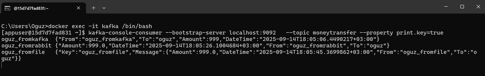

# Things it does

- A Chain of Resp for delivering a message to Kafka
- Main purpose is to deliver the message to Kafka
- If Kafka deliver fails, try rabbit mq
- If rabbit mq fails, try file logger
- Collect data on rabbitmq and log via kafka connect

Demo preview 

# Kafka connect definition

# rabbit primitive
  curl -X PUT http://localhost:8083/connectors/rmq-source/config \
  -H "Content-Type: application/json" \
  -d '{
    "connector.class": "com.github.jcustenborder.kafka.connect.rabbitmq.RabbitMQSourceConnector",
    "tasks.max": "1",
    "rabbitmq.host": "rabbitmq",
    "rabbitmq.port": "5672",
    "rabbitmq.username": "guest",
    "rabbitmq.password": "guest",
    "rabbitmq.virtual.host": "/",
    "rabbitmq.queue": "kafka_events",
    "kafka.topic": "moneytransfer",

    "key.converter": "org.apache.kafka.connect.storage.StringConverter",
    "value.converter": "org.apache.kafka.connect.storage.StringConverter",

    "transforms": "k1",
    "transforms.k1.type": "com.github.jcustenborder.kafka.connect.rabbitmq.ExtractHeader$Key",
    "transforms.k1.header.name": "kafka_key"
  }'

# rabbit

curl -X PUT "http://localhost:8083/connectors/rmq-source/config" \
  -H "Content-Type: application/json" \
  --data-binary '{
    "connector.class": "com.github.jcustenborder.kafka.connect.rabbitmq.RabbitMQSourceConnector",
    "tasks.max": "1",
    "rabbitmq.host": "rabbitmq",
    "rabbitmq.port": "5672",
    "rabbitmq.username": "guest",
    "rabbitmq.password": "guest",
    "rabbitmq.virtual.host": "/",
    "rabbitmq.queue": "kafka_events",
    "kafka.topic": "moneytransfer",

    "key.converter": "org.apache.kafka.connect.storage.StringConverter",
    "value.converter": "org.apache.kafka.connect.json.JsonConverter",
    "value.converter.schemas.enable": "false",

    "transforms": "keyFromHeader,onlyBody,bytes2str,fromJson",

    "transforms.keyFromHeader.type": "com.github.jcustenborder.kafka.connect.rabbitmq.ExtractHeader$Key",
    "transforms.keyFromHeader.header.name": "kafka_key",

    "transforms.onlyBody.type": "org.apache.kafka.connect.transforms.ExtractField$Value",
    "transforms.onlyBody.field": "body",

    "transforms.bytes2str.type": "com.github.jcustenborder.kafka.connect.transform.common.BytesToString$Value",
    "transforms.bytes2str.charset": "UTF-8",

    "transforms.fromJson.type": "com.github.jcustenborder.kafka.connect.json.FromJson$Value",
    "transforms.fromJson.json.schema.location": "Inline",
    "transforms.fromJson.json.schema.inline":
      "{ \"type\":\"object\", \"properties\": { \"From\":{\"type\":\"string\"}, \"To\":{\"type\":\"string\"}, \"Amount\":{\"type\":\"number\"}, \"DateTime\":{\"type\":\"string\"} }, \"required\":[\"From\",\"To\",\"Amount\",\"DateTime\"] }",

    "errors.tolerance": "all",
    "errors.log.enable": "true",
    "errors.log.include.messages": "true"
  }'

 # file

curl -X PUT "http://localhost:8083/connectors/file-source/config" \
  -H "Content-Type: application/json" \
  --data-binary '{
    "connector.class": "org.apache.kafka.connect.file.FileStreamSourceConnector",
    "tasks.max": "1",
    "file": "/data/input.txt",
    "topic": "moneytransfer",

    "key.converter": "org.apache.kafka.connect.storage.StringConverter",
    "value.converter": "org.apache.kafka.connect.json.JsonConverter",
    "value.converter.schemas.enable": "false",

    "transforms": "fromJson,makeKey,extractKey",

    "transforms.fromJson.type": "com.github.jcustenborder.kafka.connect.json.FromJson$Value",
    "transforms.fromJson.json.schema.location": "Inline",
    "transforms.fromJson.json.schema.inline":
      "{ \"type\":\"object\", \"properties\": { \"From\": {\"type\":\"string\"}, \"To\": {\"type\":\"string\"}, \"Amount\": {\"type\":\"number\"}, \"DateTime\": {\"type\":\"string\"} }, \"required\": [\"From\",\"To\",\"Amount\",\"DateTime\"] }",

    "transforms.makeKey.type": "org.apache.kafka.connect.transforms.ValueToKey",
    "transforms.makeKey.fields": "From",

    "transforms.extractKey.type": "org.apache.kafka.connect.transforms.ExtractField$Key",
    "transforms.extractKey.field": "From"
  }'

# Things to do
- [ ] Fix connections with the best practices. 
- [ ] Auto set of kafka connect settings
- [X] Collect those kafka events to a projection db
- [ ] Make them dispossible
